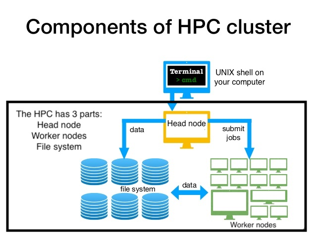

## What is a HPC made up of? 

Very often, many users are tempted to think of a HPC installation as one giant, magical machine.
Sometimes, people even assume that the machine they've logged onto is the entire computing cluster.
So what is a HPC?



HPC's have different types of machines customized for different types of tasks.
There are 3 main components to a HPC: the login node, the file system and the cluster.
The login node serves as a gateway to the cluster and serves as a single point of access.
As a gateway, it is well suited for uploading and downloading files, setting up software, and running quick tests. You shouldn't
run tests larger than 1GB on the login node, you will significantly slow it down for all other users.

**It should never be used for doing actual work**

The real work on a HPC gets done on the worker nodes.

## Accessing the HPC
Open your prefered terminal, (terminal for Mac, gitbash for Windows) you should see something similar to the following:
```
s1234567@PC12345 XXXX~$ 
```
{: .bash}

This part **PC123456 XXXX** indicates that the terminal is logged into your local computer under the user **s1234567**. If your working on a personal computer, and not a university computer then the sNumber will be missing. The `~` indicates that you are in your home directory.

> ## Network addresses: HPC vs your local computer
> The command prompt is the symbol or series of characters which precedes each shell command, and lets the user know the shell is ready to receive commands. The command prompt echo's the network address that you logged into, by default you will be logged into your local computer, which looks similar to the following `s1234567@PC012345 XXXX:~$`.
 
> When you log your terminal into the HPC (using the `ssh` command), the address changes to reflect that of the HPC, in our case `[s1234567@gc-prd-hpclogin1 ~]$` It is actually showing the username `s1234567@` and the server address `gc-prd-hpclogin1` that we have logged into.
> The following UNIX command `echo $HOSTNAME` will print the sever your terminal is logged into, and `echo $HOME` will print the home folder of the server your terminal is logged into. If your terminal is connected to the HPC, `echo $HOSTNAME` will return `gc-prd-hpclogin1`.
>

## Using ssh to connect to the HPC
You can use a graphical user interface (GUI) which is a point and click program that can be used to replace `ssh` when connecting to the HPC. We will look at using GUI's for this in a later lesson.
The `ssh` command is the first UNIX command we will learn and it allows us to securely connect our terminal remotely to UNIX servers, and use them as if they were our own.
The general syntax of the ssh command follows the format `ssh userID@some.remote.server.address`

* **some.remote.server.address** is the web address of the server you want too connect to. Griffith has multiple HPC's that can be used, each with a unique address. We will use the Griffith high-performance cluster, who's address is gc-prd-hpclogin1.rcs.griffith.edu.au

Now let's use the `ssh` command to connect to the HPC. Remember to change the generic sNumber to your own.
```
s1234567@PC12345 XXXX~$ ssh s1234567@gc-prd-hpclogin1.rcs.griffith.edu.au
```
{: .bash}

You will be prompted for your Griffith password, type it in then press ENTER.
~~~
s1234567@gc-prd-hpclogin1.rcs.griffith.edu.au's password: 
~~~
{: .bash}

If you have previously connected to the Griffith's HPC you will see the following message.
```
Last login: Fri Jan 24 14:40:59 2020 from pc12345-osx.staff.ad.griffith.edu.au
[s1234567@gc-prd-hpclogin1 ~]$
```
{: .bash}

If you've never connected to the Griffith's server before you'll encounter a message similar to this:

~~~
The authenticity of host 'gc-prd-hpclogin1.rcs.griffith.edu.au (10.250.250.3)' can't be established.
ECDSA key fingerprint is SHA256:VlHJK1c0osj32r0jFi5nSy2hZI6u1vymneqvK3D1dyI.
Are you sure you want to continue connecting (yes/no)?
~~~
{: .bash}

This is your computer warning you that you're about to connect to another computer, type \"yes\" to proceed.  This will add the HPC to your \"known hosts\", and you shouldn't see the message again the future.

After you type \"yes\", you will see:

~~~
generating ssh file /export/home/sNumber/.ssh/id_rsa ...
Generating public/private rsa key pair.
Your identification has been saved in /export/home/sNumber/.ssh/id_rsa.
Your public key has been saved in /export/home/sNumber/.ssh/id_rsa.pub.
The key fingerprint is:
SHA256:ozMjBGsgSjGwHKsTVLyQYszPAJp4poR+mAhXeAIh1qA sNumber@gc-prd-hpclogin1
The key's randomart image is:
+---[RSA 2048]----+
|@X*o.            |
|@XB+.            |
|E=Xo.            |
|XBo*             |
|*+o..   S        |
| o..   . .       |
|    . =          |
|     . +         |
|                 |
+----[SHA256]-----+
adding id to ssh file /export/home/sNumber/.ssh/authorized_keys
~~~
{: .bash}

You should now be prompted to input the password which corresponds to your Griffith sNumber. Type it in carefully (no characters will appear on the screen), then press ENTER.

~~~
s1234567@gc-prd-hpclogin1.rcs.griffith.edu.au's password: 
~~~
{: .bash}

If you entered your password appropriately the network address will change to something like this `[s1234567@gc-prd-hpclogin1 ~]$`, congratulations, you're now connected to the HPC! The network address has changed from our computer address `s1234567@PC12345 XXXX~$` to the server address `gc-prd-hpclogin1`. The `~` at the end of the HPC server address indicates that you are in your root directory on the HPC (the head node).


> ## Try logging into the Griffith HPC yourself, Which address is the HPC and which is your local computer?
>
> The XXXX in the following address will depend on the command line interface (CLI) your using, terminal (mac), gitbash (windows).
> ```
> s1234567@PC12345 XXXX~$
> ```
> {: .bash}
> 
> ```
> [s1234567@gc-prd-hpclogin1 ~]$
> ```
> {: .bash}
> 
> Try logging your terminal into Griffith's HPC. If you get stuck, ask your neighbour. Then we will go through it together
> You must be logged into Griffith's VPN to connect to the HPC. If you are not logged in you will recieve a message similar to the following
> ```
> ssh: Could not resolve hostname gc-prd-hpclogin1.rcs.griffith.edu.au: nodename nor servname provided, or not known
> ```
> {: .bash}
> > ## Solution
> > 
> > Your computer's network address (presuming you are using a Griffith issued computer)
> > ```
> > s1234567@PC12345 XXXX~$
> > ```
> > {: .bash}
> > 
> > The HPC address
> > ```
> > [s1234567@gc-prd-hpclogin1 ~]$
> > ```
> > {: .bash}
> {: .solution}
{: .challenge}

