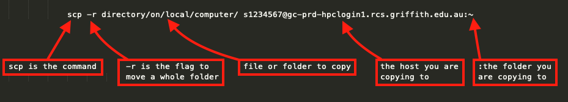

We'll cover several methods for uploading and downloading files and directories to the HPC. We will use UNIX commands in a shell, terminal (mac), gitbash (windows). In the next lesson we will learn how to use the graphical user interface (GUI, i.e. a point and click program) program WinScp. This may be easier to for with limited bash experience.

## File storage on the HPC
On the HPC you will have a home directory with 500GB of allocated space. If you require more, send a request <a href="https://conf-ers.griffith.edu.au/display/GHCD/Griffith+HPC+Support+Request+Form?src=contextnavpagetreemode" target="_blank">here</a>. 

The data that you generate on the HPC is not backed up, so you should save it somewhere else such as on <a href="https://www.griffith.edu.au/digital-solutions/research-storage" target="_blank">research space</a>

The file structure within Griffith's HPC is shown below. A HPC is a shared resource, you can access other peoples folders, so be very carefully that you are working in your home folder.


You want to be working within your home directory which will look like this `[s1234567@gc-prd-hpclogin1 ~]$`. If you use the UNIX pwd (print working directory) command it will look like this `/export/home/s1234567`. Use `cd ~` to get back to your home directory.

## Whats on my HPC space
Make sure your terminal is logged into the HPC. Before uploading files we need to check that we are in our home directory on the HPC. Use the `pwd` UNIX command to identify your current directory.

```
[s1234567@gc-prd-hpclogin1 ~]$ pwd
/export/home/s1234567
```
{: .bash}

If you did not get /export/home/s1234567, then you need to change directories.

To change directories use the `cd`command, and to change to your home directory use `~`, which represents your home directory on any UNIX computer.
```
[s1234567@gc-prd-hpclogin1]$ cd ~
```
{: .bash}

Now that you know your in your home directory you can use the UNIX command `ls`. `ls` will list the files and directories in your current directory. Note, `ls -a` will reveal hidden directories. Hidden directories will have 1 or 2 dots in front of them (e.g. .gitignore  ../).

```
[s1234567@gc-prd-hpclogin1 ~]$ ls
fpc_data  fpcHPC.sh  lscratch  parallel  raster_2.5-8  resultsIBMS3.Rout  rgdal_1.2-7  scratch
```
{: .bash}

Its a good idea to make a folder for each project you run on the HPC, this stops your home directory from becoming cluttered. A directory can be created using the `mkdir` command, followed by the name of the new directory. Note that a directory can be a single folder or a path i.e. ~/data/HPCproject1/analysis

```
[s1234567@gc-prd-hpclogin1 ~]$ mkdir data
```
{: .bash}

The `mkdir` command will create a directory called `data` in the current working directory.

> ## Navigate to your home directory and create a new directory 
>
> Navigate to your home directory and create a new directory
>
> > ## Solution
> > ```
> > [s1234567@gc-prd-hpclogin1 ]$ cd ~
> > [s1234567@gc-prd-hpclogin1 ~]$ mkdir dataPublication1 
> > ```
> > {: .bash}
> {: .solution}
{: .challenge}

### Copy data to and from your local computer to the HPC

To copy a single file to or from the  HPC, we can use the UNIX command `scp`. To upload/download a directory, we add the `-r` (recursive) flag after `scp`.
The syntax can be a little complex for new users, 
but we'll break it down here:



You need your terminal to be logged into your local computer to upload *to* the HPC *from* your computer. If your terminal is still logged into the HPC you need to exit.

```
[s1234567@gc-prd-hpclogin1.rcs.griffith.edu.au ~]$ exit
logout
Connection to gc-prd-hpclogin1.rcs.griffith.edu.au closed.
```
{: .bash}

Now you can upload data *to* the HPC.
```
s1234567@PC123456 XXXX:~$ scp directory/on/local/computer/file.txt s1234567@gc-prd-hpclogin1.rcs.griffith.edu.au:~
```
{: .bash}

You will be prompted for your password
```
s1234567@gc-prd-hpclogin1.rcs.griffith.edu.au's password:
```
{: .bash}

If successful you will see something similar to the following
```
file.txt                                             100% 1207     6.3KB/s   00:00
```
{: .bash}

If uploading a whole directory with multiple files to the HPC remember to use the `-r` flag after the scp command
```
s1234567@PC123456 XXXX:~$ scp -r ~/Downloads/test s1234567@gc-prd-hpclogin1.rcs.griffith.edu.au:~
fail.sh                                                                         100%  200     9.8KB/s   00:00    
.DS_Store                                                                       100% 6148   101.7KB/s   00:00    
node.sh                                                                         100%   93     2.0KB/s   00:00    
metaData.pdf                                                                    100%  183KB 181.6KB/s   00:01    
fslinstaller.py                                                                 100%   95KB 103.3KB/s   00:00   
```
{: .bash}

We can upload data into a directory that does not yet exist on the HPC by adding a new directory after the HPC network address.
Lets upload data to a new directory that we will call test.
```
s1234567@PC040706-OSX:~$ scp -r ~/Downloads/test s1234567@gc-prd-hpclogin1.rcs.griffith.edu.au:~/test
```
{: .bash}

To download *from* the HPC to your computer. You need your terminal to be logged into your local computer.
```
s1234567@PC040706-OSX:~$ scp s1234567@gc-prd-hpclogin1.rcs.griffith.edu.au:/scratch/file.txt /path/to/local/directory
```
{: .bash}

If its the first time downloading from the HPC you will get the following warning:
```
Warning: Permanently added 'gc-prd-hpclogin1,173.11.0.1' (ECDSA) to the list of known hosts.
file.txt
```
{: .bash}

> ## How would you create a new directory in your home directory, then upload data to it
>
> > ## Solution
> > Make sure your terminal is logged into the HPC
> > ```
> > s1234567@PC12345 XXXX~$ ssh s1234567@gc-prd-hpclogin1.rcs.griffith.edu.au
> > ```
> > {: .bash}
> > Now you can create a new directory
> > ```
> > [s1234567@gc-prd-hpclogin1 ]$ cd ~
> > [s1234567@gc-prd-hpclogin1 ~]$ mkdir dataPublication1 
> > ```
> > {: .bash}
> > Exit the HPC so your terminal is logged into your local computer
> > ```
> > [s1234567@gc-prd-hpclogin1 ]$ exit
> > Connection to gc-prd-hpclogin1.rcs.griffith.edu.au closed.
> > ```
> > {: .bash}
> > Upload data to the HPC
> > ```
> > s1234567@PC123456 XXXX:~$ scp directory/on/local/computer/file.txt s1234567@gc-prd-hpclogin1.rcs.griffith.edu.au:~/dataPublication1
> > file.txt                                             100% 1207     6.3KB/s   00:00
> > ```
> > {: .bash}
> > You can log the terminal back into the HPC using `ssh` to list the files to check
> > ```
> > s1234567@PC12345 XXXX~$ ssh s1234567@gc-prd-hpclogin1.rcs.griffith.edu.au
> > [s1234567@gc-prd-hpclogin1 ~]$ ls ./dataPublication1
> > file.txt
> > ```
> > {: .bash}
> {: .solution}
{: .challenge}

## Transferring files interactively with sftp

`scp` is useful, but what if we don't know the exact location of what we want to transfer?
Or perhaps we're simply not sure which files we want to tranfer yet.
`sftp` is an interactive way of downloading and uploading files.
Make sure your terminal is not logged into the HPC. To connect to the HPC, we use the `sftp` command followed by the server address
```
s1234567@PC12345-OSX:~$ sftp s1234567@gc-prd-hpclogin1.rcs.griffith.edu.au
```
{: .bash}

If successful we will see the following
```
sftp>
```
{: .bash}

However we only have access to a limited number of commands.

We can see which commands are available with `help`:
```
help
```
{: .bash}
```
Available commands:
bye                                Quit sftp
cd path                            Change remote directory to 'path'
chgrp grp path                     Change group of file 'path' to 'grp'
chmod mode path                    Change permissions of file 'path' to 'mode'
chown own path                     Change owner of file 'path' to 'own'
df [-hi] [path]                    Display statistics for current directory or
                                   filesystem containing 'path'
exit                               Quit sftp
get [-afPpRr] remote [local]       Download file
reget [-fPpRr] remote [local]      Resume download file
reput [-fPpRr] [local] remote      Resume upload file
help                               Display this help text
lcd path                           Change local directory to 'path'
lls [ls-options [path]]            Display local directory listing
lmkdir path                        Create local directory
ln [-s] oldpath newpath            Link remote file (-s for symlink)
lpwd                               Print local working directory
ls [-1afhlnrSt] [path]             Display remote directory listing

# omitted further output for brevity
```
{: .output}

Notice the presence of multiple commands that make mention of local and remote. We are actually connected to two computers at once, with two working directories (our local computer and the HPC).

To show our working directory on the HPC:
```
sftp> pwd
```
{: .bash}
```
Remote working directory: /export/home/s1234567
```
{: .output}

To show our local working directory, we add an `l` in front of the command:

```
sftp> lpwd
```
{: .bash}
```
Local working directory: /somewhere/on/your/computer
```
{: .output}

The same pattern follows for all other commands:

* `ls` shows the contents of our remote directory, while `lls` shows our local directory contents.
* `cd` changes the remote directory, `lcd` changes the local one.

To upload a file, we use the `put` command followed by the file to upload file.txt` (tab-completion works here).

```
sftp> put file.txt
```
{: .bash}

If succesful, you will see the following prompt
```
Uploading bfile.txt to /export/home/sNumber/file.txt
file.txt                                   100%  713     2.4KB/s   00:00 
```
{: .bash}

To download a file we use the `get` command followed by the file `file.txt`:

```
sftp> get file.txt
```
{: .bash}
```
Fetching /global/home/yourUsername/file.txt to file.txt
/export/home/s1234567/file.txt                               100%  713     9.3KB/s   00:00 
```
{: .output}

And we can recursively put/get files by just adding `-r`.
Note that the directory needs to be present beforehand. To make a directory we use the `mkdir` command followed by the name we
would like to call the new directory

```
sftp> mkdir data
sftp> put -r data/
```
{: .bash}
```
Uploading content/ to /export/home/s1234567/data
Entering data/
data/scheduler.md              100%   11KB  21.4KB/s   00:00    
data/index.md                  100% 1051     7.2KB/s   00:00    
data/transferring-files.md     100% 6117    36.6KB/s   00:00    
data/.transferring-files.md.sw 100%   24KB  28.4KB/s   00:00    
data/cluster.md                100% 5542    35.0KB/s   00:00    
data/modules.md                100%   17KB 158.0KB/s   00:00    
data/resources.md              100% 1115    29.9KB/s   00:00    
```
{: .output}

To quit, we type `exit` or `bye`. 

## Data storage on your account

You are assigned 200GB of storage. You can temporarily exceed this quota, but will need to remove excess data once you have finished using it. 
To see how much storage you have used run the command du -kh.
```
[s1234567@gc-prd-hpclogin1 ~]$ du -kh ~
0	    /export/home/s5001793/.gnome2
0	    /export/home/s5001793/.mozilla/extensions
0	    /export/home/s5001793/.mozilla/plugins
0	    /export/home/s5001793/.mozilla
24K	    /export/home/s5001793/.ssh
24K	    /export/home/s5001793/parallel/Meta
56K	    /export/home/s5001793/parallel/R
336K	/export/home/s5001793/parallel/doc
52K	    /export/home/s5001793/parallel/help
0	    /export/home/s5001793/sw/Modules
0	    /export/home/s5001793/sw
296K	/export/home/s5001793/test/test
2.7M	/export/home/s5001793/test
0	    /export/home/s5001793/data
16K	    /export/home/s5001793/workshop
4.0K	/export/home/s5001793/.elinks
16M	    /export/home/s5001793
```
{: .bash}

To remove data use the remove `rm` command, followed by the file. If you want to remove a directory add `-r` flag after `rm`.