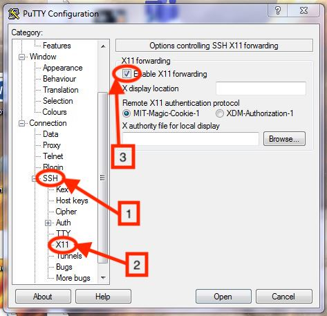
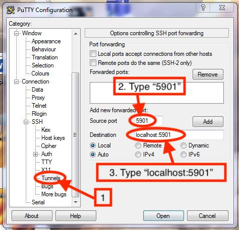
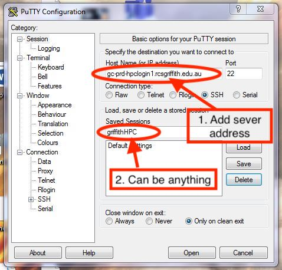
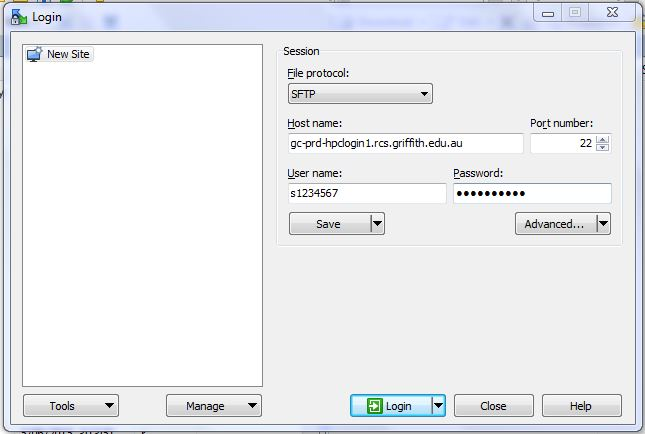
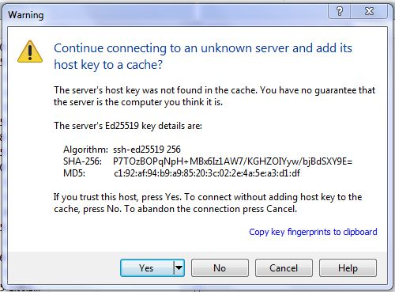
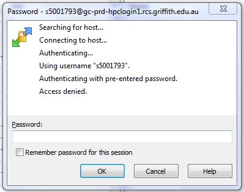
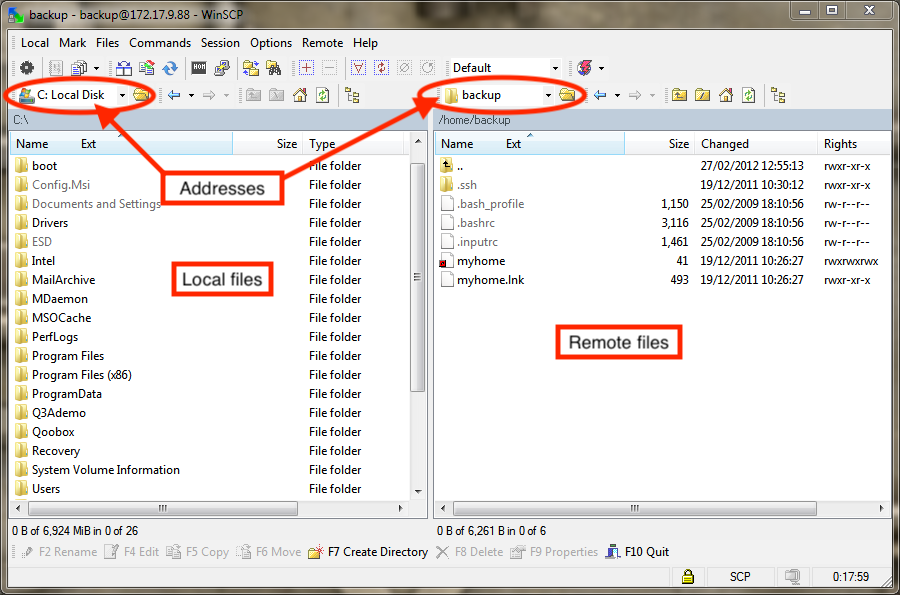
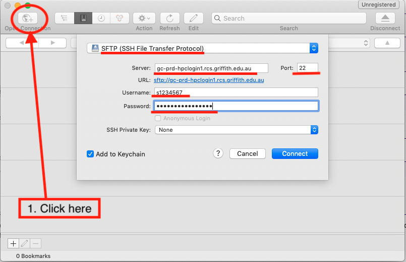
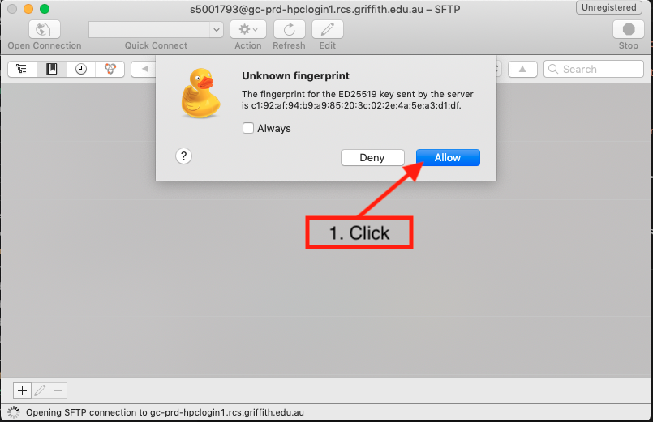
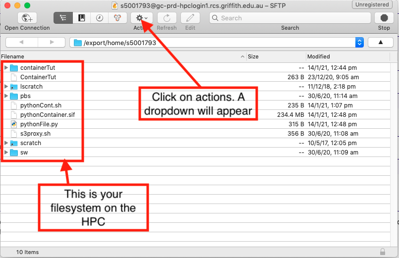

## What is an emulator

## Using putty as a ssh and scp emulator to move files to and from the HPC 

It is strictly speaking not necessary to have a terminal running on your local computer in order to access and use a remote system, only a window into the remote system once connected. PuTTy is likely the oldest, most well-known, and widely used software solution to take this approach. I would recommend using UNIX commands, ultimately they are quicker.

PuTTY is freely available to download from www.putty.org. Download the version that is correct for your operating system and install it as you would other software on you Windows system. Once installed it will be available through the start menu or similar.

Running PuTTY will not initially produce a terminal but instead a window full of connection options. Putting the address of the remote system in the “Host Name (or IP Address)” box and either pressing enter or clicking the “Open” button should begin the connection process.

If this works you will see a terminal window open that prompts you for a username through the “login as:” prompt and then for a password. If both of these are passed correctly then you will be given access to the system and will see a message saying so within the terminal. If you need to escape the authentication process you can hold the control/Ctrl key and press the c key to exit and start again.

Note that you may want to paste in your password rather than typing it. Use control/Ctrl plus a right-click of the mouse to paste content from the clipboard to the PuTTY terminal.

For those logging in with PuTTY it would likely be best to cover the terminal basics already mentioned above before moving on to navigating the remote system. 

Once putty is installed, start putty
Start ==> All Programs ==> puTTy ==> puTTy

Configure the cluster login node as follows:

Open ssh on the left pane and click on X11 and enable X11 forwarding:

Click on Tunnels on the left pane and Enter:

source ports : 5901
Destination: localhost:5901
Click Add button

Click on Sessions on the left pane and Enter for host name: clogin1.rcs.griffith.edu.au
And for saved session type a name that reminds you of which HPC it is (can be anything alphanumeric, NO spaces). Double click or select Open to connect to the HPC.

If you have enabled X11 port forwarding and enabled a local Xming X11 Windows server, type "xclock" and a clock should pop up on your desktop.

## Using WinSCP as a ssh and scp emulator to move files to and from the HPC

WinSCP is a cross-platform client for securly downloading and uploading files to and from a remote computer. Files can be moved using ftp, ftps, scp, sftp, WebDAV or S3 file transfer protocols.

<a href="https://winscp.net/download/WinSCP-5.15.9-Setup.exe" target="_blank">Download</a> and install the WinSCP client.

After installation, Click on:
Start -> All Programs -> WinSCP --> WinSCP
Click on "new"

For the hostname, type: "clogin1.rcs.griffith.edu.au"
User name: yours sNumber
Password: Leave it blank for now

Leave everything else as it is.

Click on login button
If it is the first time you are logging into this server, it will prompt you to agree to add the ssh keys into local cache. (Click YES).

Next it will prompt for password.

If the login is successful, it will provide a window with two panes.
The left hand pane is the local file system (your local drive) and the right hand pane is the remote file system on the rcsxfer machine.
(Click yes to login).

Simply click on the drop down window to navigate to other folders on the local drive.

To transfer files, simply drag and drop the files between the two panes.

> ## Working with Windows
> When you transfer files to from a Windows system to a Unix system 
> (Mac, Linux, BSD, Solaris, etc.) problems can occur.
> Windows encodes its files slightly different than Unix,
> and adds an extra character to every line.
> 
> On a Unix system, every line in a file ends with a `\n` (newline).
> On Windows, every line in a file ends with a `\r\n` (carriage return + newline).
> This causes problems sometimes.
> 
> Though most modern programming languages and software handles this correctly,
> in some rare instances, you may run into an issue.
> The solution is to convert a file from Windows to Unix encoding with the `dos2unix` command.
> 
> You can identify if a file has Windows line endings with `cat -A filename`.
> A file with Windows line endings will have `^M$` at the end of every line.
> A file with Unix line endings will have `$` at the end of a line.
> 
> To convert the file, just run `dos2unix filename`.
> (Conversely, to convert back to Windows format, you can run `unix2dos filename`.)
{: .callout}

> ## A note on ports
> All file tranfers using the above methods use encrypted communication over port 22.
> This is the same port used by SSH.
> In fact, all file transfers using these methods occur through an SSH connection.
> If you can connect via SSH over the normal port, you will be able to transfer files.
> If your cluster uses a non-standard port, you'll need to change the port for sftp/scp 
> as well.
{: .callout}

## Using cyberduck as a ssh and scp emulator with a mac

You can <a href="https://cyberduck.io/download/" target="_blank"> download Cyberduck here. </a>

First you will need to open a connection to the HPC, click on the open connection button. A new pop-up window will appear, add the information that is underlined red in the below screenshot.

If this is the first time using cyberduck to access the Griffith HPC you will get the pop-up window shown in the following screenshot. You can click the "Always" box and click "Allow", this is a security feature.

Now you should see your file system in the HPC, you've successfully logged in. If you click on the "Actions" button, a dropdown menu will appear. 
This menu includes:
* New Folder - create a new folder on the HPC
* Upload - move files from your computer to the HPC
* Download - move files from the HPC to your computer
* Edit with - edit a file that is on the HPC
* Delete - delete files on the HPC

