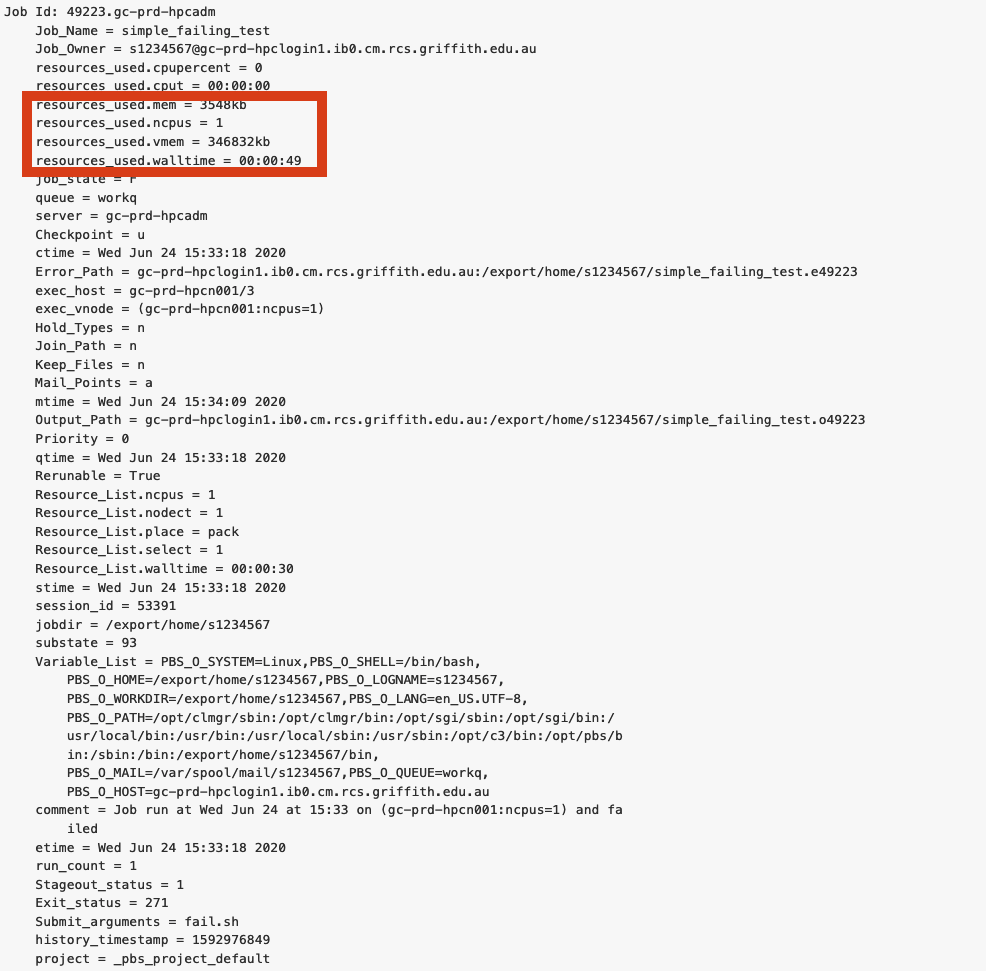
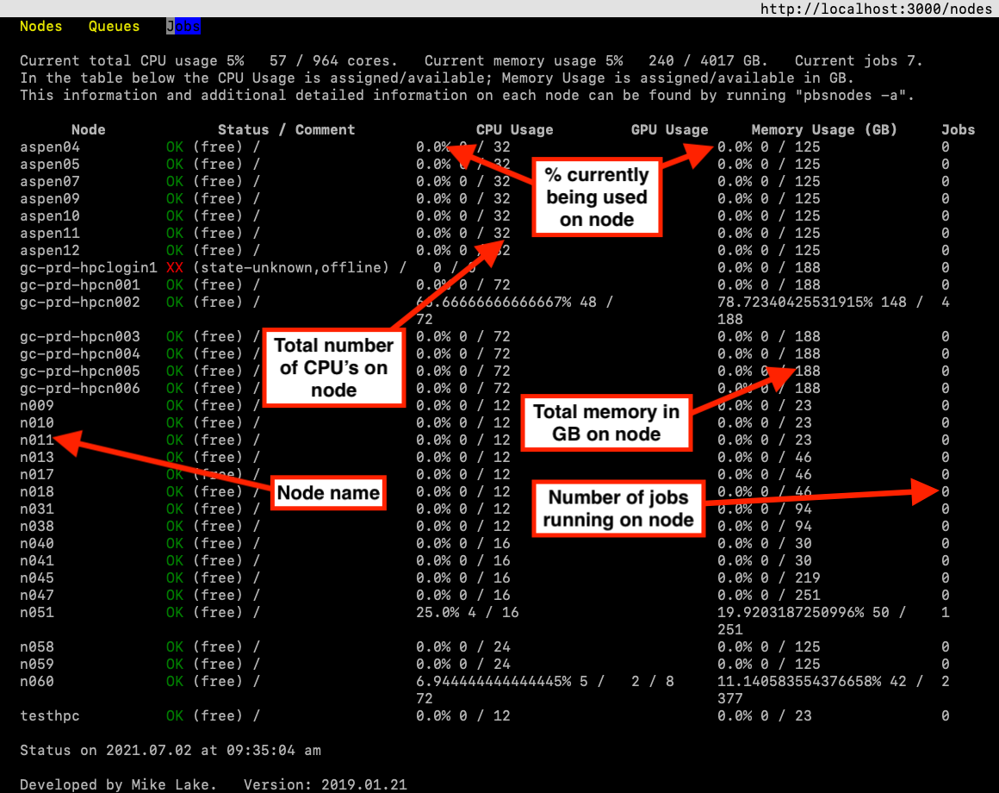

We now know virtually everything we need to know about getting stuff on a HPC.
We can log on, submit different types of jobs, use preinstalled software, 
and request software/package installs.
Now we need to request an efficient amount of HPC time, memory, cpu's and gpu's. 

## Estimating required resources using the scheduler

In the previous tutorial `Scheduling jobs` we learnt how to request resources with the PBS scheduler.
But how do we know how much and what type of resources we will need to effectively run our job? 

The answer is, we don't. 
Not until we've tried it ourselves at least once.
We'll need to benchmark our job and experiment with it before
we know how much it needs in the way of resources. If we request to few resources, our job will be cut/throw an error before its finished. If we request to many resources, the job may wait in the queue indefinately, or the job will take far longer to run as it sits waiting for the require resources to become availabe. 

Here are a couple of tips to help figure out how many resources you may need:

* Have you run the job before? If so, use the specs of the computer you ran it on as an estimate. If you know that the script takes 2 hours to run on your laptop using 1CPU and 16GB RAM. Then you can request these specs for the HPC.
* Run your job on a subset of the data and see how much resources it uses. You can start by requesting 2 CPUs and 8 GB of RAM for 2 hours. You can then run it on more units, and perhaps even try to estimate a scaling relationship to guess how much running N units of data will require.
* If you are not sure request a small amount and see what happens, your job will either complete or stop mid way through. If it stops before processing has finished, increase the resources, do this until it completes successfully!

A good rule of thumb is to ask the scheduler for more time and memory than your job can use.
This value is typically two to three times what you think your job will need.

### Resource requests

But what about more important changes, such as the number of CPUs and memory for our jobs?
One thing that is absolutely critical when working on an HPC system is specifying the 
resources required to run a job.
This allows the scheduler to find the right time and place to schedule our job.

The following are several key resource that we can request in our PBS scheduler script:

* **#PBS -l** The -l flag takes multiple arguments used to request HPC resources for you job.
   * **ncpus** Number for cpu's to allocate; 
   * **ngpus** Number for gpu's to allocate; 
   * **mem** Amount of memory to allocate (gb); 
   * **walltime** maximum amount of time allocated to the job in hours:minutes:seconds. Requesting to much walltime can prevent the job from running as the scheduler will keep the job in the que waiting for a large enough opening. While to little walltime will result in the job getting terminated before its finished processing. Later on, we will look into estimating the require wall time.
   * **ngpus** if not using gpu's.

### Running a small job to check how much resources you use
If possible, run a job as a small subset. Then query the HPC using "qstat -xf jobID", then you can see how much was used for that run and scale it up appropriately.



There are two general ways you can subset your job, the dataset and the computations.

Examples: </br>
Dataset - partitioning a dataset into small chunks that can be individually processed
Computation - Using a for loop to read a large number of csv files into the HPC.
Computation - Performing cross validation on classification or regression models.

Scaling up from a test run to the full dataset can get tricky if you are running your job in parallel computing. This is because the relationship between number of CPU's and processing time is not linear, its an exponential curve that slowly flattens out. We will talk about this in a later session that is dedicated to parallel computing. 

### How many CPU's should I request
Remember that many scripting programs (including python and R) will only use 1 CPU unless you have set up your script/job to run in parallel (i.e. on multiple CPU's at once). If your job is not set up to run in parallel then requesting multiple CPU's can slow down process time, as the scheduler will wait until multiple CPU's are avaliable before submitting your job. 

It is also worth considering the trade off between number of CPU's and time spent waiting in queue. For example, your job takes 3 hours to run on 4 CPU's, and the queue time may only be 1 hour. If you use 12 CPU's, your job takes 1 hour to run, BUT, the queue time may be 12 hours as the scheduler needs to wait until 12 CPU's are available.
So its a good idea to first check the amount of usage on the HPC, it might be busy, or it might be free.

### Check usage on the HPC nodes

Sometimes the HPC is busy (especially during sememster break when researchers don't have teaching commitments), and sometimes the HPC is quiet. If you are going to submit a large job log onto the HPC and see how busy it is using the pnodes command, and the following window will appear, type q or control+C to exit.

```
[s1234567@gc-prd-hpclogin1 ~]$ pnodes
```
{: .bash}



type "q" to exit this view.

You can run your job on a specific node using one of the following commands in your scheduler script.
```
#PBS -l nodes = 'node_name'
#PBS --constraint = 'node_name'
```
{: .bash}


> ## How would you estimate resources for the following jobs
>
> You have 500 DNA samples, you want to run each sample independently through a bioinformatics script that you wrote.
>
> > ## Solution
> >
> > Are the samples all the same size? If so then run several random samples through your bioinformatics script, take note on how long each run took, average the times if nesecarry. Then linearly scale that time up to 500 samples, add some more time for good measures.
> >
> {: .solution}
{: .challenge}

> You have a single DNA sample and a bioinformatics script runs 1000 simulations on it. 
>
> > ## Solution
> >
> > Does each simulation take about the same amount of time to run? Not sure then check.
> > Take the time/average time to run 1 simulation and linearly scale it up to 1000, and add some extra time for good measure.
> {: .solution}
{: .challenge}

> You have a 100 DNA samples and a bioinformatics script that runs 1000 simulations on each sample. 
>
> > ## Solution
> >
> > Does each simulation and each sample take about the same amount of time to run? Not sure then check.
> > Take the time/average time to run 1 simulation on one sample and linearly scale it up to 100 samples and 1000 simulations, and add some extra time for good measure.
> {: .solution}
{: .challenge}

> You have a 100 DNA samples and your bioinformatics script does some one-off preprocessing on each sample then runs it through 1000 simulations. 
>
> > ## Solution
> >
> > Does each simulation and each sample take about the same amount of time to run? Not sure then check.
> > Assuming that they take the same amount of time. Take the time:
> > * to preprocess each DNA sample once, this will be scaled up to 100 samples (as it only runs once). 
> > * to run 1 simulation on one sample, linearly scale it up to 100 samples and 1000 simulations
> > * add some extra time for good measure.
> {: .solution}
{: .challenge}